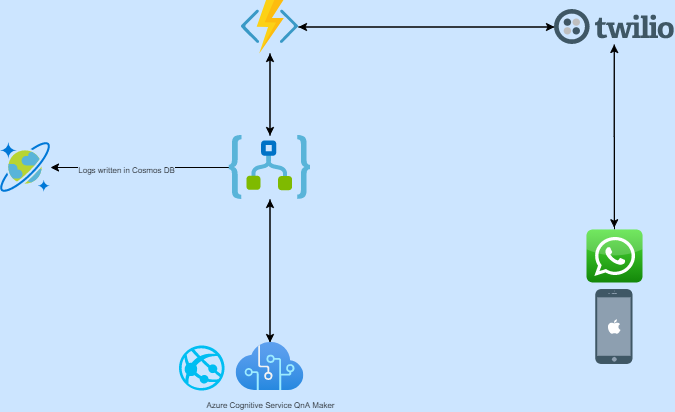

# WhatsAppQ-A_Bot

### Summary

an application where customers could ask questions on WhatsApp which would then be answered by a Q&A bot

### Background

Teachers at a school were using up a lot of time answering questions of parents after school which would take time away from their work preparing for the next day.

### Goal
To automate the questioning and answering process by having a FAQ bot answer the more common questions. 

### Proposed Solution

This application used Twilio as the connector to collect the WhatsApp messages and has azure functions as the API endpoint to answer the questions.

